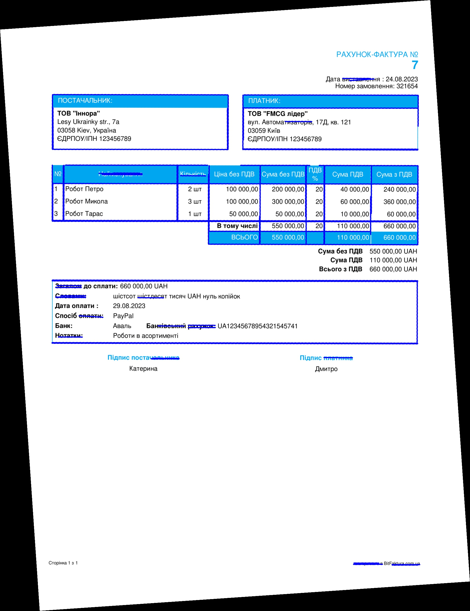

# Innora_test_task

## Project contents 
|file             |description
|-----------------|------------------------------------------------------------|
|invoices_rotated | folder containing rotated images for testing the algorithm|
|angle_detection.py | script to calculate the rotation angles of input images|
|image_rotation.py | script to rotate the images from the 'invoices_rotated' folder by the calculated angle|
|predicted_angles.json | the file generated by the angle_detection.py script. It contains image path as a key and a predicted rotation angle as a value (10 key-value pairs in total)|
|requirements.txt | libraries used in the project|

## Run the program 

Write the following commands (after the $ sign) in the terminal to run the program:<br>
```bash

$ python3 -m venv env
$ source env/bin/activate
$ pip3 install -r requirements.txt
$ python3 angle_detection.py
invoices_rotated/0.png: 7
invoices_rotated/1.png: -2
invoices_rotated/2.png: -9
invoices_rotated/3.png: -7
invoices_rotated/4.png: -1
invoices_rotated/5.png: -6
invoices_rotated/6.png: 5
invoices_rotated/7.png: -2
invoices_rotated/8.png: -4
invoices_rotated/9.png: -1
invoices_rotated/10.png: -4
$ python3 image_rotation.py
```
The last command writes rotated input images into the 'rotated_images' folder.

## Script explanation
The opencv-python library was used to calculate the rotation angle of images. The calculate_angle() function was defined to handle this problem. It takes a path to an image as an argument and processes it in the following way:
1. The image is turned to grayscale;
2. The <a href='https://www.geeksforgeeks.org/python-opencv-canny-function/'> Canny function</a> function is applied to the grayscale images to detect the edges;
3. The HoughLinesP function detects the lines;
4. The for loop is defined to loop over the detected lines and calculate the angle of each line with respect to the horizontal axis. These angles are stored in the 'angles' list;
5. This function returns the median angle of all the lines in the image thus representing the overall orientation of the image.<br>

Example of an image with lines detected using this function:


The rotate_image() function calculates the rotation angle within the [-30,30] degrees range using the predefined calculate_angle() function and rotates each input image by the calculated angle. The rotated images are saved to the 'rotated_images' folder.
